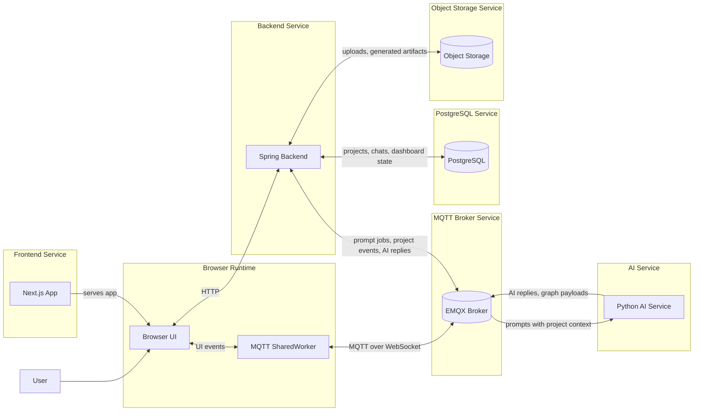

# DataForgeAI

DataForgeAI is an analytics prototype for uploaded business data, chat-driven exploration, and generated charts.

Its core design choice is that the backend, not the model, owns project scope. Uploads, chat threads, generated charts, and pinned dashboard cards all belong to a backend-defined project, while the AI service only processes jobs the backend prepares and scopes.

## Runtime Topology

## Key Ideas

- Next.js frontend for project interaction and chart workflows
- Spring backend as the source of truth for projects, chats, and dashboard state
- MQTT-based job and event flow between backend and AI service
- Python AI service restricted to backend-scoped jobs rather than free-form model access

## Core Invariants

- A project is the durable state boundary for uploads, chats, graphs, and pinned outputs.
- The backend decides which project data an AI job can see and remains the persistence authority for results.
- The AI service executes prompt interpretation and chart generation against backend-scoped context.
- The browser shares one MQTT runtime across tabs through a SharedWorker.
