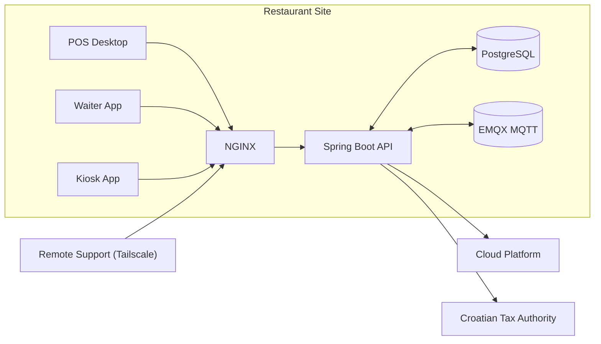

# Raspberry Pi (Spring)

This is the Raspberry Pi-hosted Spring side of the hospitality POS system, running as the local backend for a single restaurant site.

It coordinates the parts of the product that need to keep working on the LAN, persist state locally, integrate with external systems, and hold up under real operating conditions.

## Runtime Topology

## Main Engineering Areas

- Local backend contracts across desktop POS, waiter, kiosk, and workstation flows
- Secure device bootstrap, device identity, and operator authentication
- Pull-based cloud sync plus sectioned local sync for desktop clients
- MQTT-backed real-time coordination for claims, dispatch, messaging, and health
- Correctness-sensitive receipt issuance, recovery, and Croatian tax authority integration
- Diagnostics collection, retention, and remote support retrieval
- Hardware discovery, workstation pairing, and routed print dispatch
- Raspberry Pi provisioning, pinned machine state, and post-install operations

## Feature Deep Dives

- [Provisioning and fleet operations](./features/01-provisioning-and-fleet-operations/README.md)
- [Device bootstrap and auth](./features/02-device-bootstrap-and-auth/README.md)
- [Local sync and cloud reconciliation](./features/03-local-sync-and-cloud-reconciliation/README.md)
- [MQTT coordination and LAN runtime](./features/04-mqtt-coordination-and-lan-runtime/README.md)
- [Tax authority integration and recovery](./features/05-tax-authority-integration-and-recovery/README.md)
- [Remote LAN printer discovery and transport](./features/06-lan-printer-discovery-and-transport/README.md)

## Stack and Deployment

- Java / Spring Boot
- PostgreSQL
- EMQX MQTT
- NGINX
- Tailscale
- Ubuntu Server on Raspberry Pi
- Provisioning and operations scripts for install, update, backup, restore, and logging

## What This Work Covers

- Backend architecture for a multi-client on-site system
- Real-time messaging and local coordination
- Sync and local-state ownership
- Operational deployment on a physical device
- Reliability-focused product engineering beyond the happy path
