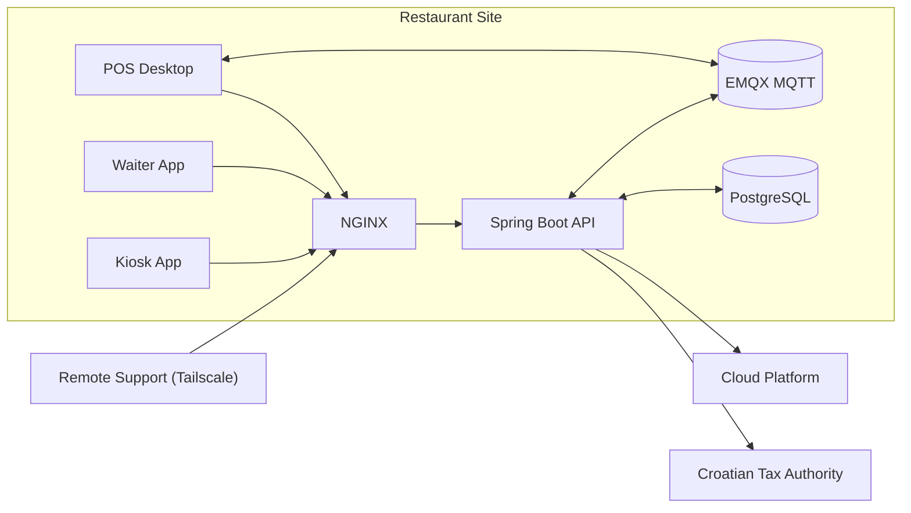

# Raspberry Pi (Spring)

The Raspberry Pi-hosted Spring node is the local authority for a restaurant site. It owns the responsibilities desktop clients should not: local persistence, device trust, LAN coordination, cloud reconciliation, and tax reporting.

This design keeps transactional correctness, device trust, and fiscal workflows on the site node rather than scattering them across clients.

## Runtime Topology

## Site Responsibilities

- Act as the on-site authority for register enrollment, device trust, and operator-backed access
- Keep one locally correct site view through cloud hydrate, incremental reconciliation, and client sync
- Own receipt issuance, fiscal reporting, and recovery when delivery is delayed or uncertain
- Coordinate post-commit LAN events such as claims, dispatch, and workstation signaling without treating MQTT as the source of record
- Centralize site operations such as provisioning, diagnostics, and remote printer transport

## Feature Deep Dives

Main backend deep dives:

- [Device bootstrap and auth](./features/02-device-bootstrap-and-auth/README.md)
- [Local sync and cloud reconciliation](./features/03-local-sync-and-cloud-reconciliation/README.md)
- [Tax authority integration and recovery](./features/05-tax-authority-integration-and-recovery/README.md)

Supporting runtime and operations notes:

- [Provisioning and fleet operations](./features/01-provisioning-and-fleet-operations/README.md)
- [MQTT coordination and LAN runtime](./features/04-mqtt-coordination-and-lan-runtime/README.md)
- [Remote LAN printer discovery and transport](./features/06-lan-printer-discovery-and-transport/README.md)

## Stack and Deployment

- Java / Spring Boot
- PostgreSQL
- EMQX MQTT
- NGINX
- Tailscale
- Ubuntu Server on Raspberry Pi
- Provisioning and operations scripts for install, update, backup, restore, and logging
