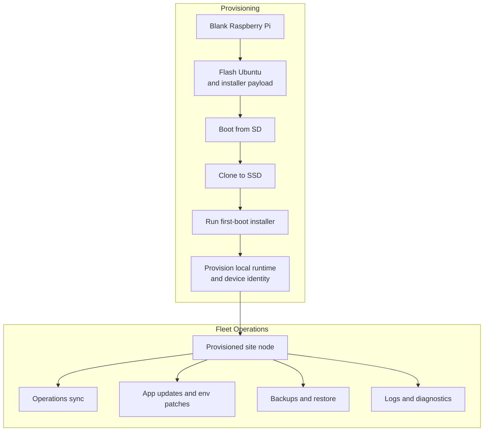

# Provisioning and Fleet Operations

This is how a blank Raspberry Pi becomes a site-ready POS node, and how installed nodes are updated afterward without full reprovisioning.

## What It Covers

- First-boot installation for a fresh Raspberry Pi
- SSD-based deployment instead of running production from the SD card
- Pinned local runtime setup for Spring, PostgreSQL, EMQX, NGINX, and TLS
- Per-device identity and secret generation during installation
- Site-scoped configuration for access keys, VPN identity, and tax certificates
- Batch operations over Tailscale for updates, patches, backups, restores, and logs

## Why It Matters

This work was about making on-site deployment repeatable, site-scoped, and operationally safe. Each Raspberry is provisioned as its own node with its own generated secrets and identity, so devices are not interchangeable across sites and compromise blast radius stays confined to a single hospitality location. Once installed, nodes can be targeted remotely, updated in batches, and operated through a controlled runner with locking, audit logging, and rollback-aware workflows.
