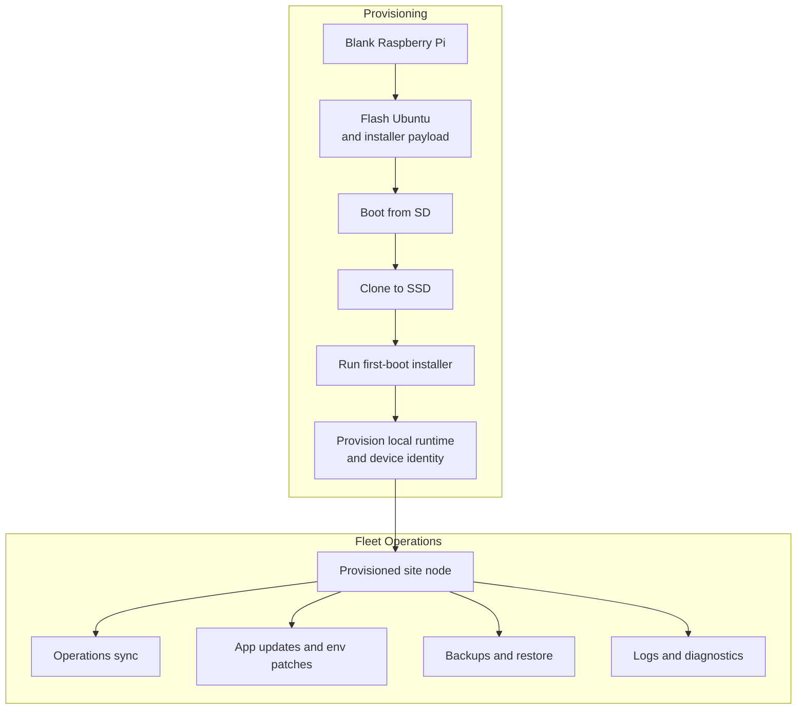

# Provisioning and Fleet Operations

A blank Raspberry Pi becomes a site-ready POS node through this provisioning path, and the same node can later be updated, backed up, restored, and inspected in place.

## What It Covers

- First-boot installation for a fresh Raspberry Pi
- SSD-based deployment instead of running production from the SD card
- Pinned local runtime setup for Spring, PostgreSQL, EMQX, NGINX, and TLS
- Per-device identity and secret generation during installation
- Site-scoped configuration for access keys, VPN identity, and tax certificates
- Batch operations over Tailscale for updates, patches, backups, restores, and logs

## Why It Matters

Each site node was built to be replaceable production infrastructure. Production runs from SSD, first boot provisions site-bound runtime and secrets, and every later update, backup, restore, or log pull goes through one locked site runner so field operations stay predictable.
