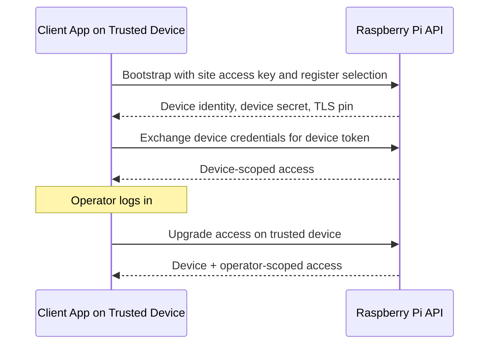

# Device Bootstrap and Auth

The Raspberry Pi is the local authority for register identity inside a hospitality site.

A fresh app install is not usable until it bootstraps into that site as a specific register. After that, the app can acquire device-scoped access automatically, and operator login happens on top of that already trusted device context.

## Bootstrap

Bootstrap is the moment a fresh install becomes a trusted site register.

The app installation presents the site access key, selects a register identity, and asks the Raspberry node to enroll it into the local register cluster. On success, it receives site-scoped device credentials and the TLS pin used for subsequent LAN communication.

After bootstrap, the install is that register as far as the site is concerned. Communication with the Raspberry node runs over certificate-pinned TLS, and the install operates as a trusted site register client.

Only one active device identity can exist per register. If a new machine bootstraps as a register that is already claimed, that register identity is reassigned to the new install and the previous install becomes unusable until it bootstraps again.
That reassignment happens through the same site-key bootstrap path that issues a new device identity for that register.
Register reassignment therefore requires the enrollment secret itself, beyond any existing operator session on the old machine.

## Access After Bootstrap

After bootstrap, the app exchanges its issued device credentials for a device JWT automatically on startup.

Protected APIs check device trust before operator identity. Operator login does not establish trust from scratch; it upgrades an already trusted device session by adding user identity on top of device identity.

The trust model stays split into:

- site enrollment
- one-register-one-device binding
- transport trust
- device-scoped access
- device + user-scoped access

## Why It Matters

This lets the Raspberry Pi decide which installs are actually part of the site register cluster. Register ownership is explicit, TLS trust is established during enrollment, and every protected workflow runs on top of trusted device context.
