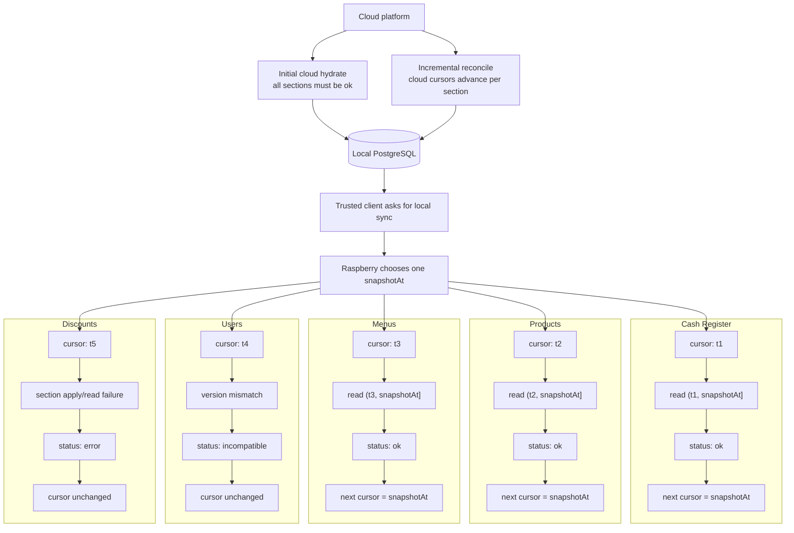

# Local Sync and Cloud Reconciliation

The Raspberry Pi hydrates from cloud once, reconciles incrementally after that, and serves local clients from one snapshot-bounded view of the site database.

Legend

- `ok` advances that section to `snapshotAt`
- `incompatible` and `error` keep that section on its previous cursor

- Hydrate is all-or-nothing.
- Incremental cloud sync is per-section.
- Local sync is bounded by one `snapshotAt`.
- Only `ok` sections advance their cursor.

## What This Accomplishes

This keeps the site locally usable, lets failed sections recover cleanly without blocking the rest, and allows sync contracts to evolve section by section without corrupting client state or silently skipping data.
