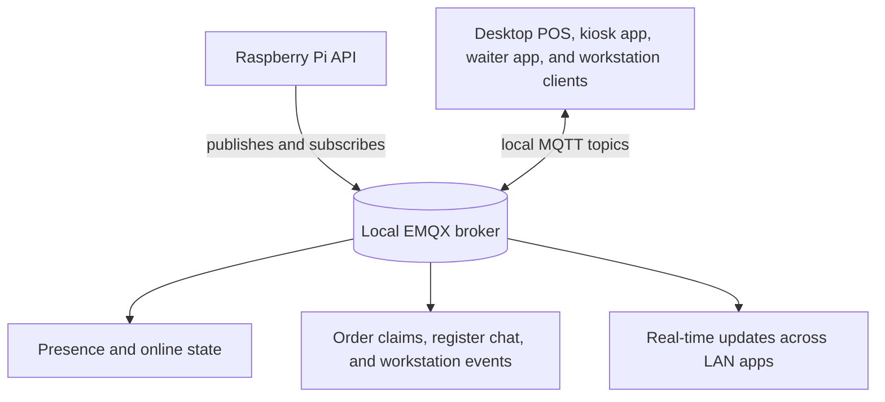

# MQTT Coordination and LAN Runtime

This side uses local EMQX as the LAN event bus for client presence, runtime coordination, and feature-specific messaging inside one hospitality site.

- The Raspberry node uses local EMQX as a shared messaging layer for every app on the site LAN.
- That messaging layer is used for online presence, claim and release coordination, register-to-register chat, workstation dispatch, activity fan-out, and operational signals.
- Features publish typed events instead of polling each other directly, so each client can react to changes happening elsewhere in the site.
- State-changing flows often publish only after database commit so runtime events stay aligned with committed local state.

## What This Work Covers

- Presence and online-client tracking
- Order claim and release coordination for kiosk and waiter flows
- Workstation-targeted order dispatch
- Register-to-register chat command handling and event fan-out
- Activity-stream ingestion and websocket forwarding
- Operational signals like health samples and logging mode changes

## What This Accomplishes

This gives the site one local messaging fabric for presence, fan-out, coordination, and targeted runtime actions without forcing every feature into direct HTTP polling.
