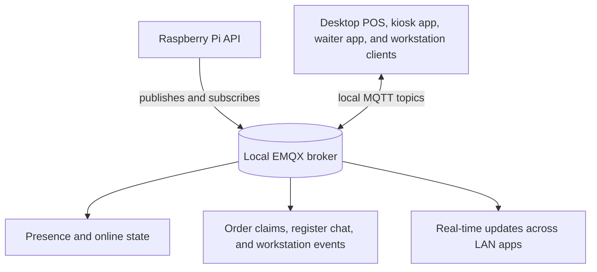

# MQTT Coordination and LAN Runtime

The site uses a local EMQX broker as its coordination layer. MQTT carries change events, claim visibility, and real-time reactions across the LAN, while durable business state stays in the API and database.

- Local clients subscribe to feature-specific topics for presence, order claims, workstation dispatch, register chat, activity fan-out, and operational signals.
- Clients can publish coordination commands and presence signals, but commands only become real outcomes after the Raspberry validates them and persists the result.
- MQTT drives live coordination, while committed orders, receipts, and other final outcomes still come from the API and database.

## Why It Matters

This gives the site one local coordination layer for presence, fan-out, and targeted runtime actions. MQTT keeps the LAN reactive; the API and database keep the site correct.
