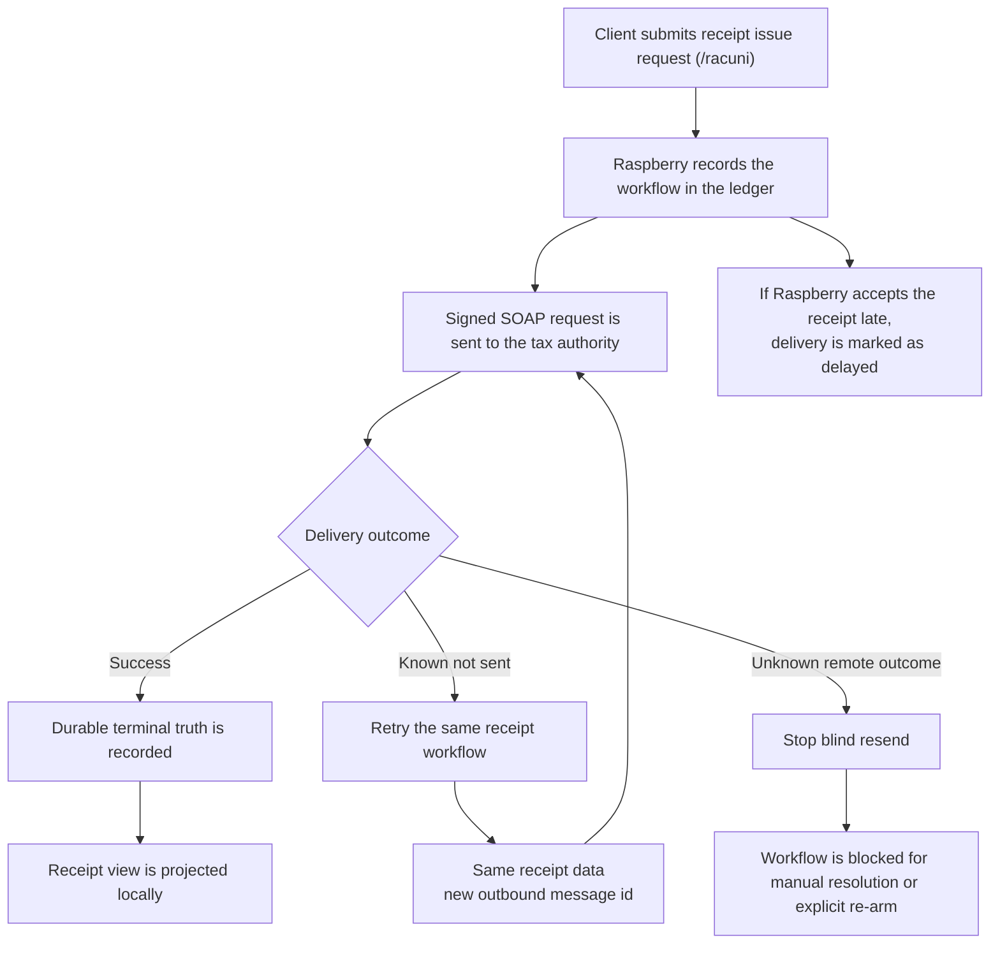

# Tax Authority Integration and Recovery

This flow is built around one outcome: one real sale must end as one canonical receipt, even when reporting to the tax authority is delayed or uncertain.

- The receipt itself stays stable: receipt number, business time, taxes, total, and `ZKI` do not change during recovery.
- Delivery attempts are allowed to change: each outbound send can use a new message id while still representing the same receipt.
- The ledger stores the request, the response, and the recovery state so the server can replay the latest durable truth instead of guessing.
- `KNOWN_NOT_SENT` failures can continue automatically on the same workflow.
- `UNKNOWN_REMOTE_OUTCOME` stops blind resend for `/racuni`, because the previous attempt might already have been accepted by the tax authority.
- POST success is driven by durable reported outcome, not by whether the local receipt row has already been materialized.

## What This Work Covers

- Signed tax-authority exchange from the Raspberry node
- Durable request and response recording in the ledger
- Delayed-delivery handling for receipts accepted after the original issue moment
- Recovery rules that separate safe retry from unsafe retry
- Receipt projection and canonical read recovery after tax-authority acceptance succeeds

## What This Accomplishes

This keeps tax-authority reporting safe under retries, outages, and ambiguous transport failures without letting the same real-world sale be reported twice.
