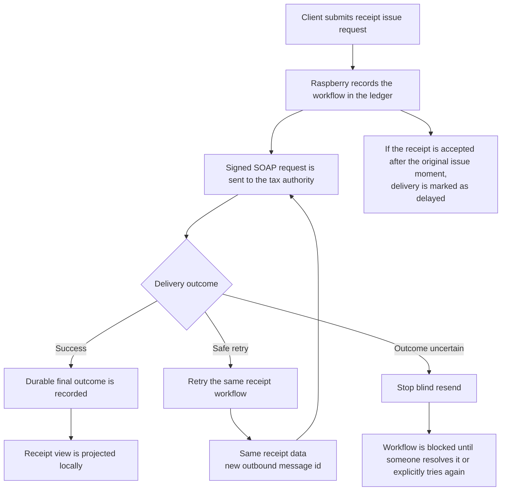

# Tax Authority Integration and Recovery

This flow is built around one outcome: one real sale must end as one canonical receipt, even when reporting to the tax authority is delayed or uncertain.

- The receipt itself stays stable: receipt number, business time, taxes, total, and receipt fiscal signature do not change during recovery.
- Delivery attempts are allowed to change: each outbound send can use a new message id while still representing the same receipt.
- The ledger stores the request, the response, and the recovery state so the server can replay the latest confirmed outcome instead of guessing.
- Automatic retry stays inside the same receipt workflow only when the previous attempt failed before tax-authority acceptance.
- If the remote outcome is uncertain, the system stops blind resend, because the previous attempt might already have been accepted by the tax authority.
- The workflow succeeds only after a durable reported outcome is recorded, not when a local receipt row merely exists.

## What This Work Covers

- Signed tax-authority exchange from the Raspberry node
- Durable request and response recording in the ledger
- Delayed-delivery handling for receipts accepted after the original issue moment
- Recovery rules that separate safe retry from unsafe retry
- Receipt projection and canonical reads after tax-authority acceptance

## What This Accomplishes

This keeps tax-authority reporting safe under retries, outages, and ambiguous transport failures while preserving one canonical receipt path for each real-world sale.
