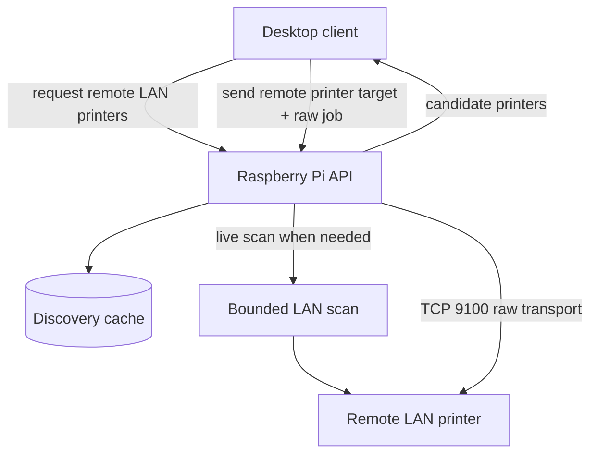

# Remote LAN Printer Discovery and Transport

The Raspberry Pi handles remote printer discovery and raw transport for printers elsewhere on the same site LAN. Desktop clients request remote printers from the Raspberry, which performs discovery and raw TCP 9100 transport on their behalf.

- Discovery is live and cache-backed.
- Scanning is bounded to the site LAN.
- The Raspberry handles raw printer transport at the site boundary.
- Clients choose the printer; the Raspberry handles raw transport and surfaces failures in one place.

## What This Accomplishes

This keeps remote printer discovery and raw transport at one site boundary, so clients can choose printers without each becoming its own LAN scanner and raw-socket transport client.
