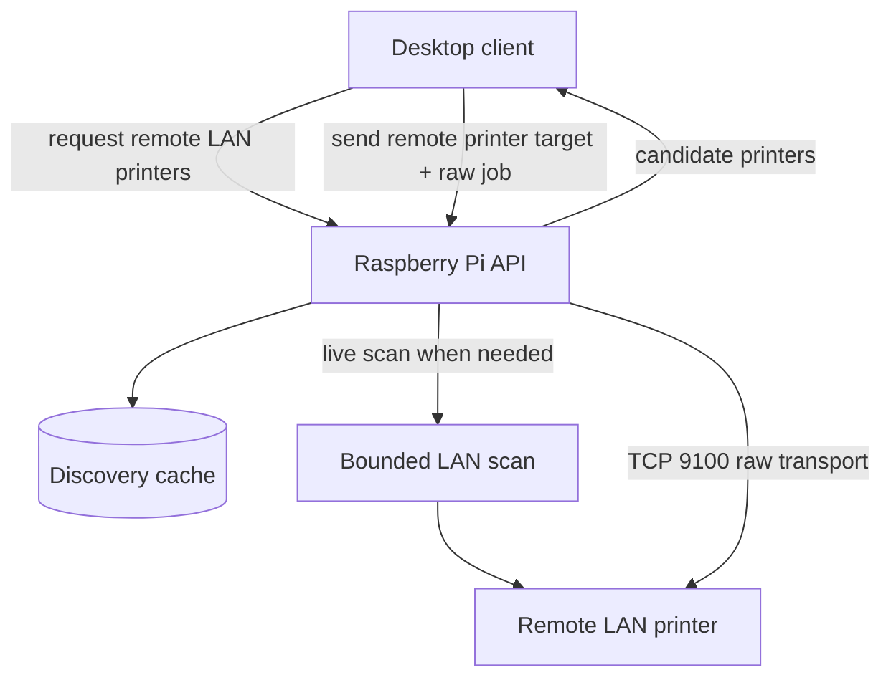

# Remote LAN Printer Discovery and Transport

The Raspberry Pi exposes live remote-printer discovery and raw transport for printers elsewhere on the same site LAN, not the printer attached to the current register.

- Discovery is live and cache-backed.
- Scanning is bounded to the site LAN.
- The Raspberry owns raw printer transport; routing decisions stay above this layer.

## What This Accomplishes

This keeps remote printer discovery and transport in one LAN-visible backend instead of duplicating low-level printer logic across clients.
