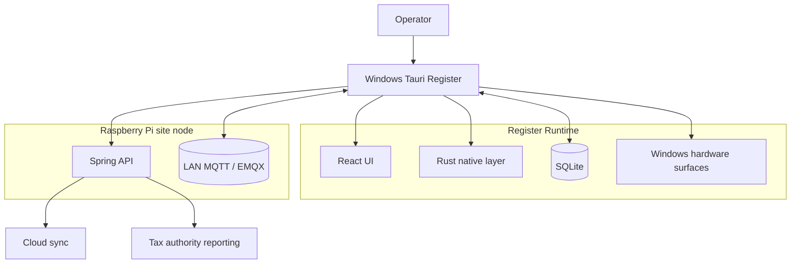

# Windows (Tauri)

This is the Windows desktop side of the hospitality POS system, running as the operator-facing register application inside a single restaurant site.

It owns the part of the product that has to feel fast, touch-native, reliable under degraded conditions, and deeply integrated with the local Raspberry Pi runtime that coordinates the site.

## Runtime Topology

## Main Engineering Areas

- Secure LAN discovery, trusted routing, and register enrollment into a site cluster
- Safe mode and recovery flows when Raspberry, MQTT, or internet connectivity is lost
- App-wide touch orchestration for tap, swipe, drag, long-press, and pinch interactions
- Grid workspace runtime for navigation, movable surfaces, nested views, and shared layouts
- Blueprint floor-plan editing and live table-based service flows
- Cluster-safe order handling, claim and release coordination, and receipt lifecycle work
- Built-in register-to-register communication across the same site
- Site-wide theming plus per-operator language preferences

## Stack and Runtime

- Rust / Tauri
- React / TypeScript
- SQLite
- Windows-native printer and display integration
- LAN HTTPS and MQTT against the Raspberry Pi site node
- Web Workers and OffscreenCanvas where interaction surfaces need extra responsiveness

## What This Work Covers

- Desktop product engineering for a real operator environment
- Native runtime integration beyond a browser-only app shell
- Touch-first interaction design and custom UI runtime systems
- Multi-register coordination across a shared on-site cluster
- Reliability-focused UX under failure and recovery conditions
