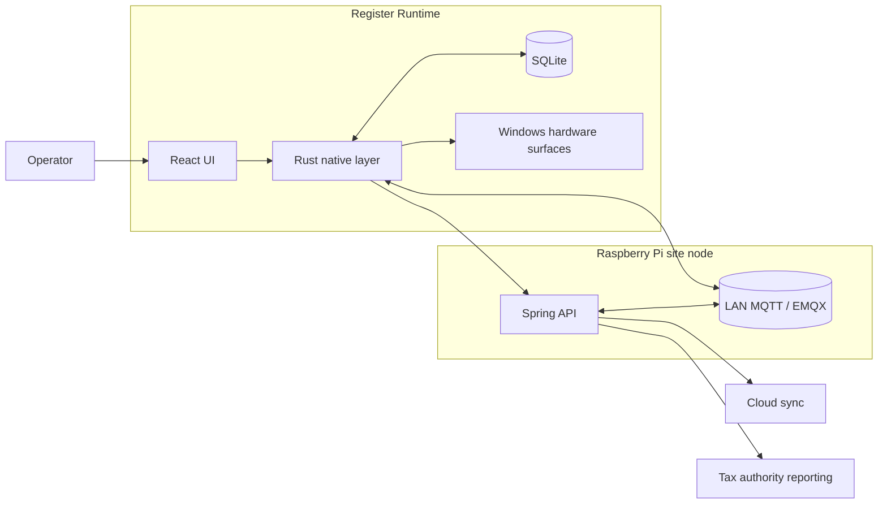

# Windows (Tauri)

This is the Windows desktop side of the hospitality POS system, running as the operator-facing register runtime inside a single restaurant site.

It owns the part of the product that has to feel fast, touch-native, reliable under degraded conditions, and deeply integrated with the local Raspberry Pi runtime that coordinates the site.

  

## Runtime Topology

## Main Engineering Areas

- Secure LAN discovery, trusted routing, and register enrollment into a site cluster
- Safe mode and recovery flows when Raspberry, MQTT, or internet connectivity is lost
- App-wide touch orchestration for tap, swipe, drag, long-press, and pinch interactions
- Grid workspace runtime for navigation, movable surfaces, nested views, and shared layouts
- Blueprint floor-plan editing and live table-based service flows
- Cluster-safe order handling, claim and release coordination, and receipt lifecycle work
- Built-in register-to-register communication across the same site
- Site-wide theming plus per-operator language preferences

## Feature Deep Dives

- [Raspberry discovery and trusted LAN routing](./features/01-raspberry-discovery-and-trusted-lan-routing/README.md)
- [Safe mode and recovery flows](./features/02-safe-mode-and-recovery-flows/README.md)
- [Gesture orchestrator and touch input](./features/03-gesture-orchestrator-and-touch-input/README.md)
- [Grid workspace system](./features/04-grid-workspace-system/README.md)
- [Floor plan editor](./features/05-floor-plan-editor/README.md)
- [Orders, receipts, and table operations](./features/06-orders-receipts-and-table-operations/README.md)
- [Register-to-register chat](./features/07-register-to-register-chat/README.md)
- [Theming and localization](./features/08-theming-and-localization/README.md)

## Stack and Runtime

- Rust / Tauri
- React / TypeScript
- SQLite
- Windows-native printer and display integration
- LAN HTTPS and MQTT against the Raspberry Pi site node
- Web Workers and OffscreenCanvas where interaction surfaces need extra responsiveness

## What This Work Covers

- Desktop product engineering for a real operator environment
- Native runtime integration beyond a browser-only app shell
- Touch-first interaction design and custom UI runtime systems
- Multi-register coordination across a shared on-site cluster
- Reliability-focused UX under failure and recovery conditions
