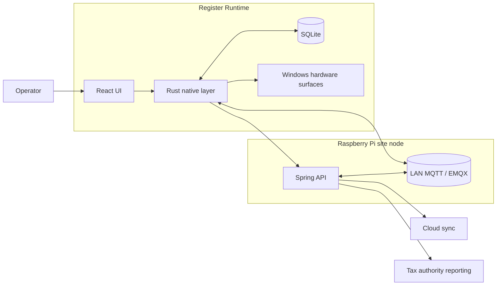

# Windows (Tauri)

The Windows app is the desktop register runtime for a restaurant site cluster, built for fast operator workflows, device integration, and reliable degraded operation.

The desktop client is not just a UI shell: it owns local persistence, device-facing behavior, trusted site routing, and recovery paths across desktop-to-backend boundaries.

  

## Runtime Topology

## Key Elements

- Secure LAN discovery and trusted routing to the correct Raspberry-backed site node
- Cluster-safe order handling, claim/release coordination, and receipt lifecycle handling
- Shared floor-plan editing and live table service on top of Raspberry-backed site state

## Additional Areas

- Safe mode and degraded-operation recovery when Raspberry, MQTT, or internet connectivity is lost
- Touch-input arbitration across nested tap, scroll, drag, swipe, long-press, and pinch surfaces
- One grid workspace model powers both movable catalog content and full-screen operational modules
- Raspberry-mediated live register coordination, register-local theming, and per-operator language preferences

## Feature Deep Dives

Main deep dives:

- [Raspberry discovery and trusted LAN routing](./features/01-raspberry-discovery-and-trusted-lan-routing/README.md)
- [Orders and receipts](./features/06-orders-receipts-and-table-operations/README.md)
- [Floor plan editor](./features/05-floor-plan-editor/README.md)

Additional deep dives:

- [Safe mode and recovery flows](./features/02-safe-mode-and-recovery-flows/README.md)
- [Gesture orchestrator and touch input](./features/03-gesture-orchestrator-and-touch-input/README.md)
- [Grid workspace system](./features/04-grid-workspace-system/README.md)
- [Register-to-register chat](./features/07-register-to-register-chat/README.md)
- [Theming and localization](./features/08-theming-and-localization/README.md)

## Stack and Runtime

- Rust / Tauri
- React / TypeScript
- SQLite
- Windows-native printer and display integration
- LAN HTTPS and MQTT against the Raspberry Pi site node
- Web Workers and OffscreenCanvas where interaction surfaces need extra responsiveness
