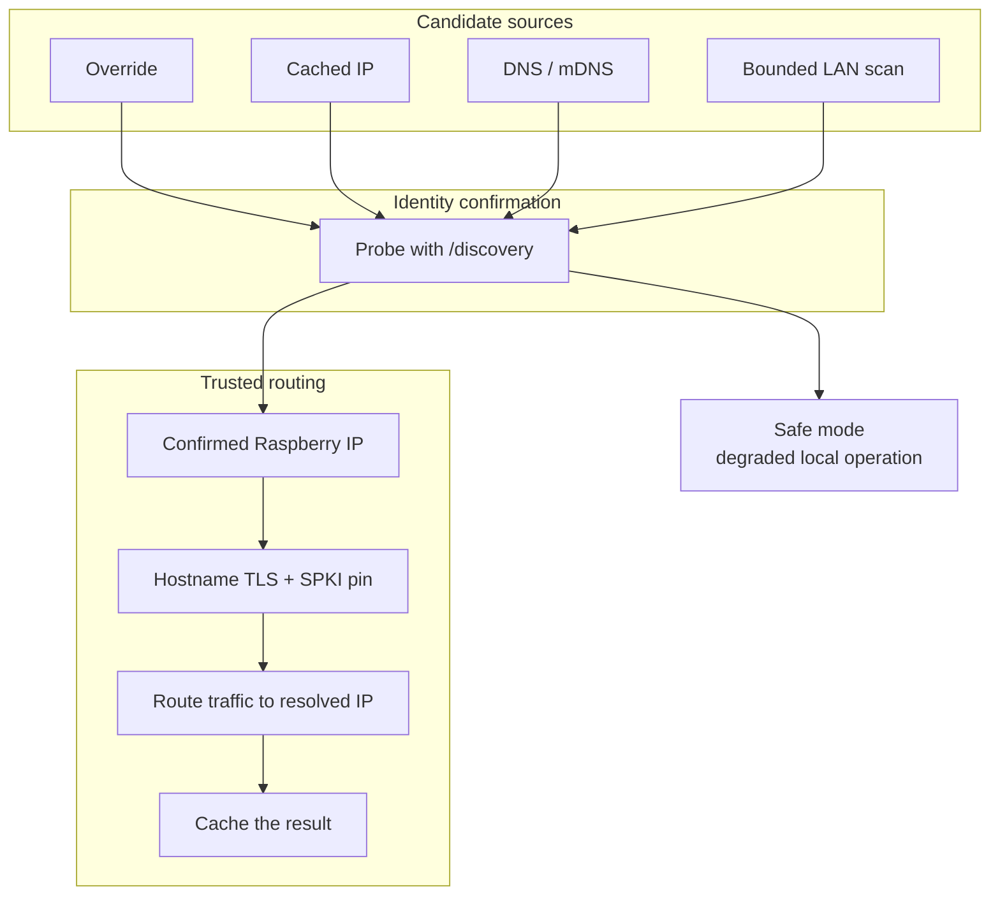

# Raspberry Discovery and Trusted LAN Routing

The desktop client does not blindly trust one hostname or one IP. It resolves the Raspberry through multiple bounded sources, confirms identity with one simple contract, and then keeps hostname-based TLS trust while routing traffic to the discovered LAN IP.

## How It Works

- Ordered candidate sources: explicit override, cached IP, hostname resolution, then bounded LAN scan
- Each candidate must satisfy one identity contract: `GET /discovery` must return `204`
- The winning LAN IP is applied through a runtime DNS override instead of replacing the trusted hostname
- HTTPS keeps using the Raspberry hostname and pinned SPKI trust while traffic is routed to the discovered IP
- The resolved IP is cached for faster restarts on the same site network

## Why It Matters

This lets the desktop client survive DHCP changes, broken `.local` resolution, and site-network churn without giving up trusted transport or forcing operators to manually reconfigure each workstation.
