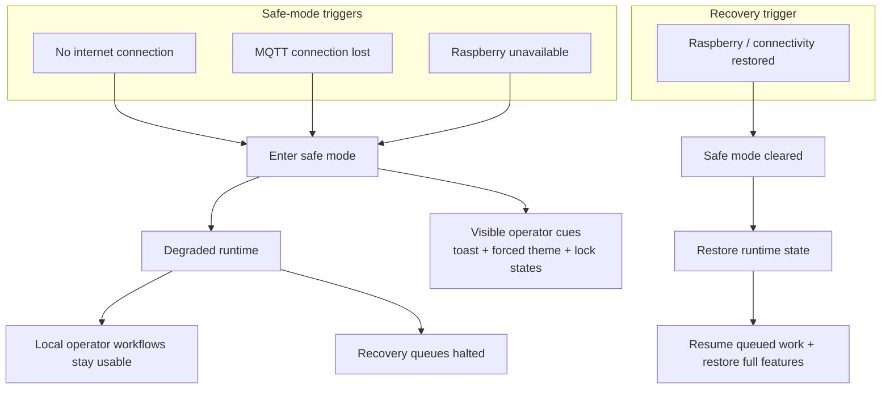

# Safe Mode and Recovery Flows

Safe mode keeps the register operational during internet, MQTT, or Raspberry outages: local work stays available, anything that depends on Raspberry authority, MQTT coordination, or external confirmation pauses, and queued work resumes automatically when connectivity returns.

  

## Runtime Flow

## How It Works

- Safe mode starts when internet, MQTT, or Raspberry connectivity is lost.
- The UI makes degraded state obvious with warning toasts, a forced safe-mode theme, lock indicators, and unavailable backend-dependent views.
- Local durable work stays available while Raspberry-backed actions and recovery queues pause.
- When connectivity returns, the app restores runtime state and resumes queued work.

## Why It Matters

This makes degraded operation explicit and predictable: operators can keep working, correctness-sensitive work stays on the right side of the backend boundary, and recovery happens automatically when the site comes back.
