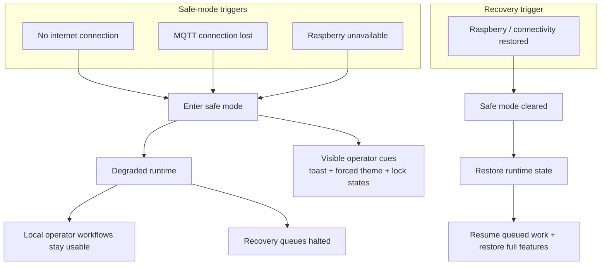

# Safe Mode and Recovery Flows

Safe mode keeps the register operational during internet, MQTT, or Raspberry outages by making degraded state explicit to operators and automatically restoring paused work when connectivity returns.

  

## Runtime Flow

## How It Works

- Safe mode is a shared runtime state triggered by lost internet, broken MQTT connectivity, or an unreachable Raspberry node
- The frontend reacts immediately with warning toasts, a forced safe-mode theme, lock indicators, and not-available states in backend-dependent views
- The register does not hard-stop; local operator workflows stay available while remote-dependent actions are blocked or deferred
- Recovery queues intentionally stop while safe mode is active and resume only after connectivity and auth are restored
- On exit, the app returns to normal operation, restores missing runtime state, and resumes queued recovery work

## Why It Matters

This makes degraded operation explicit instead of unpredictable: operators can keep working, correctness-sensitive work is not pushed through a broken backend path, and recovery happens automatically when the site comes back.
