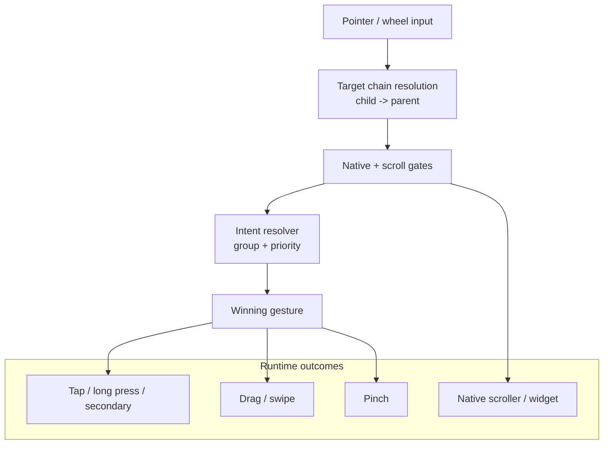

# Gesture Orchestrator and Touch Input

The app does not rely on browser-default touch behavior. It runs an app-wide gesture orchestration layer that turns raw pointer input into deterministic tap, long-press, drag, swipe, and two-finger pinch behavior across nested UI.

## How It Works

- Input is routed through one app-wide gesture layer
- One pointer sequence resolves to one owner, so child and parent surfaces stay on one gesture path
- Native scrollers and protected widgets can stay on their own path before app-level arbitration runs
- Single-touch and multi-touch paths are separated early, so drag and scroll arbitration does not race pinch handling

## Why It Matters

This is what gives the app a touch-first feel: interactions stay fluid, nested surfaces behave predictably, and operators can move through the interface quickly and confidently.
