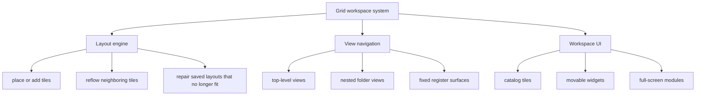

# Grid Workspace System

The grid workspace is the register’s core UI runtime. Products, folders, widgets, full-screen modules, layout state, and in-app navigation all run through the same custom tile system. The register feels like one coherent workspace instead of a stack of unrelated screens.

  

## Runtime Flow

## Core Contract

- Every surface in the app is represented as a tile with bounds on the same grid
- Full-screen modules work by using tiles that span the whole grid
- Nested folders open another workspace view on the same tile model
- If a saved workspace no longer fits the current monitor, the same grid rules repair it and keep the workspace usable

## Runtime Ownership

- The native side resolves grid size from the monitor, seeds fixed register areas, and loads persisted workspace pages
- A dedicated worker owns placement and displacement math, so drag and add operations stay off the UI thread
- The renderer keeps active workspace state, current path, fixed register surfaces, and presentation of worker results
- Layout repair uses the same placement rules when saved workspaces no longer fit the current grid

## Why It Matters

A single workspace model keeps the register usable across monitor changes, nested navigation, and full-screen operational views.
