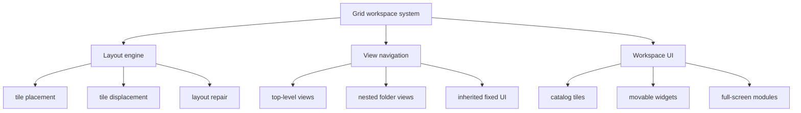
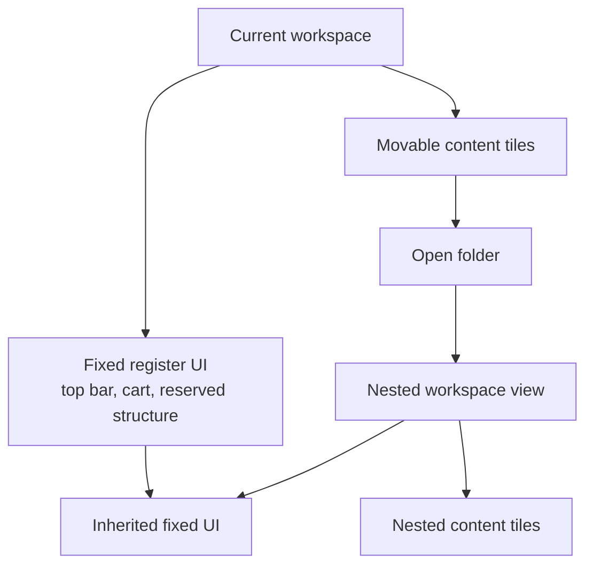

# Grid Workspace System

This is the core runtime of the Tauri app. The register surface is one tile-based workspace, and the engine works the same regardless of what a tile contains: a product, a menu, a folder, a widget, or an entire operational view.

That is why the same system can power both small movable tiles and full-screen surfaces. Some tiles are tiny, some span large parts of the grid, and some cover the whole grid, but the placement, movement, persistence, and navigation model stays the same.

  

## Runtime Flow

## Core Idea

- Every surface in the app is represented as a tile with bounds on the same grid
- The engine only cares about tiles as layout units, so the same runtime works whether a tile contains a catalog item, a folder, a widget, or a whole view
- Full-screen modules work by using tiles that span the whole grid
- Smaller tiles can stay movable and interactive inside the same runtime

## How The Runtime Works

- The native side resolves grid size from the monitor, seeds fixed register areas, and loads persisted workspace pages
- The renderer keeps active workspace state, current navigation path, inherited fixed UI, and pending changes
- A dedicated worker owns placement and displacement math, so drag and add operations stay off the UI thread
- The UI consumes worker updates and renders the resulting tile state with smooth transitions

## Layout Engine

- Dragging a tile runs through drop-target evaluation, overlap detection, and controlled displacement of eligible neighbors
- Fixed structural areas and protected surfaces stay stable while movable tiles rearrange around them
- If a tile cannot stay where it was, the engine searches for the next valid placement inside the grid
- When a workspace loads, the same engine repairs saved layouts against the current grid size and removes or relocates invalid placements
- Batch adds use the same path, so adding many items still goes through the real placement engine

## Navigation and Depth

- Entering a folder opens another workspace view with its own tile set
- Fixed register UI is carried deeper where it still matters, so nested views keep the same shell
- The workspace path becomes the navigation model for moving in and out of nested views
- Top-level areas such as dashboard, settings, daily totals, orders and receipts, chat, and delivery views all use the same runtime

## What The App Uses It For

- Register surface with movable catalog tiles and folders
- Nested folder pages inside the same register workspace
- Full-screen operational modules rendered through the same workspace model
- Widget creation through the same add-item flow used for other grid content
- Editing and saving user-arranged layouts, workspace thumbnails, and workspace selection

## Why It Matters

This is what gives the app its living operator surface. One runtime handles composition, movement, navigation, and persistence across the whole register, while giving each location the freedom to shape its workspace around its own workflow. Those layouts can still be shared across registers within the same site cluster through the Raspberry node, so operators get local flexibility without losing operational consistency.
