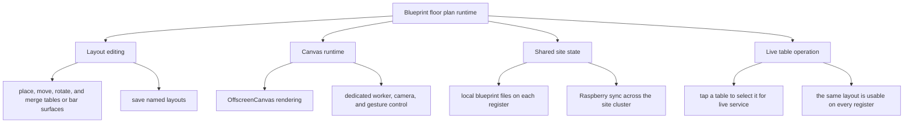

# Blueprint Floor Plan Editor

Blueprint is a swipe-up floor-plan surface built into the register, where operators can design the venue layout, save named room maps, and work those same tables live during service.

It is also shared across the hospitality site through the Raspberry node, so a blueprint edited on one register can appear on the others without each device maintaining its own separate room map.

## Core Idea

- Blueprint has an edit mode for shaping the room and a work mode for handling live tables on the same surface
- A blueprint session is a saved room layout with placed elements, camera state, and its own identity
- The runtime works with table and bar elements, not a hardcoded venue shape, so each location can arrange the room around its real service flow

## How It Works

- Tables and bar surfaces are typed elements with bounds, numbering, variants, rotation, and merge rules, so larger shapes can be built from the same primitives
- Rendering runs through `OffscreenCanvas` with a dedicated worker, which owns scene drawing, animations, merge highlighting, delete feedback, and viewport-aware rendering
- The UI layer handles controls, persistence, and operational state while camera and gesture logic support pan, zoom, pinch, drag, rotate, snap, and delete flows
- Saved blueprints are persisted locally, exposed through named sessions, and listed with generated thumbnails in the app's settings
- Blueprint files are also pushed to and refreshed from the Raspberry-backed site state, so room layouts stay consistent across registers in the same cluster
- In work mode, touching a table is operational, not just visual: the selected blueprint element feeds table metadata into the cart and table context for live service

## What It Enables

- Each location can shape its own room layout instead of being forced into one fixed table scheme
- Registers across the same site can share the same blueprint instead of drifting into different room maps
- Operators can move from room layout to live table work on the same surface without leaving the register flow

## Why It Matters

This gives the POS a real spatial model of the venue instead of a static table list. Layout editing, shared site state, and live table handling all live in one runtime, which makes the register easier to adapt to different hospitality spaces while keeping the room model consistent across devices.
