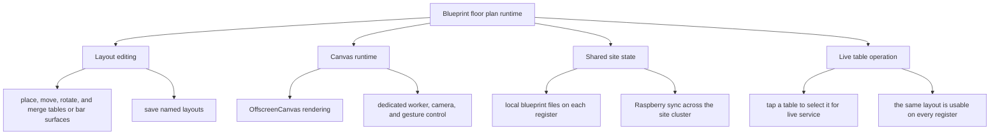

# Blueprint Floor Plan Editor

Blueprint is the register’s floor-plan runtime. Operators edit the venue layout and work live tables during service on a shared room model.

The Raspberry node holds the shared floor-plan state, so a layout edited on one register can appear on the others. Each register keeps a local working copy of the blueprint, while the Raspberry-backed site state is the shared copy other registers refresh from.

  

## Runtime Flow

## Core Idea

- Blueprint has an edit mode for shaping the room and a work mode for handling live tables on the same surface
- A blueprint session is a saved room layout with placed elements, camera state, and its own identity
- The runtime works with table and bar elements, so each location can arrange the room around its real service flow

## How It Works

- Tables and bar surfaces are typed elements with bounds, numbering, variants, rotation, and merge rules, so larger shapes can be built from the same primitives
- Rendering runs through `OffscreenCanvas` with a dedicated worker, which owns scene drawing, animations, merge highlighting, delete feedback, and viewport-aware rendering
- The UI layer handles controls, persistence, and operational state while camera and gesture logic support pan, zoom, pinch, drag, rotate, snap, and delete flows
- Saved blueprints are persisted locally, exposed through named sessions, and listed with generated thumbnails in the app's settings
- Blueprint files are also pushed to and refreshed from the Raspberry-backed site state, so room layouts stay consistent across registers in the same cluster
- The Raspberry-backed copy is the shared sync point across registers
- In work mode, touching a table selects it for live service and feeds table metadata into the cart and table context

## What It Enables

- Each location can shape its own room layout around its real service flow
- Registers across the same site can share the same blueprint through one shared room model
- Operators can move from room layout to live table work on the same surface without leaving the register flow

## Why It Matters

This gives the POS a real spatial model of the venue. Editing, site sync, and live table handling stay attached to the same layout, so the register can adapt to different spaces without splitting those flows apart.
