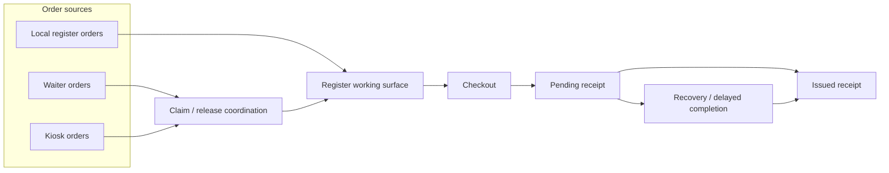

# Orders and Receipts

Orders from the register, waiter and kiosk apps can land in one register workflow. A register can keep working locally while shared order ownership and final receipt outcome remain under site authority.

  

## Runtime Flow

## Who Owns What

- The register owns the working surface, cart state, and in-progress edits.
- Waiter and kiosk orders become local only after claim and release coordination grants that claim.
- Receipt issuance becomes final only when the site-side receipt workflow records the final confirmed outcome.
- Recovery continues the same receipt lifecycle, so one sale stays on one receipt path.

## Why It Matters

This keeps two registers from working the same remote order and keeps a locally finished checkout aligned with the site's real receipt outcome.
