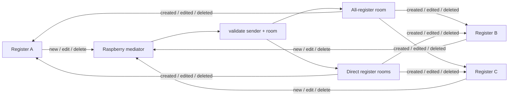

# Register-to-Register Chat

Register-to-register chat is a live coordination surface built into the desktop POS, with one shared all-register room and direct register-to-register rooms for faster operator communication inside the same site.

The Raspberry Pi mediates the whole flow. Registers publish chat commands into the local site runtime, the Raspberry validates them, and connected registers receive the resulting room events back over LAN MQTT.

## Core Idea

- Registers do not talk directly to each other; the Raspberry stays in the middle and keeps room traffic coherent across the site
- The chat is intentionally live and ephemeral, optimized for in-service coordination rather than long-term message storage
- Room state stays lightweight enough to feel immediate, while still supporting unread counts, room switching, and presence cues

## How It Works

- Each register loads the active desktop peers from the Raspberry and derives one shared room plus deterministic direct-message rooms between register pairs
- Sending, editing, and deleting a message publishes a room command into local MQTT instead of doing client-to-client networking
- The Raspberry validates that the sender is an active desktop register and that the target room is allowed before it republishes the resulting room event
- Connected registers keep message state, unread counts, and viewer activity locally while online indicators come from the same LAN client-presence model used elsewhere in the app
- Safe mode keeps the chat surface readable but disables message composition while the register is in degraded operation

## What It Enables

- Fast operator coordination across the same hospitality site without leaving the register UI
- Broadcast communication for the whole register cluster plus direct register-to-register conversations
- Lightweight live messaging that fits a LAN runtime instead of introducing a heavier persisted chat subsystem

## Why It Matters

This gives the site an immediate communication layer between registers without adding a separate messaging product. The Raspberry stays in control of room traffic, the UI stays fast, and operators get just enough live coordination to keep service moving.
