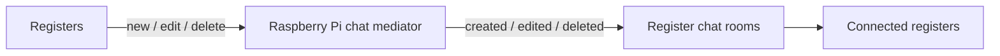

# Register-to-Register Chat

Live, non-persistent chat between active desktop registers on the same site.

The Raspberry Pi mediates the whole flow. Registers publish chat actions into the local site runtime, the Raspberry validates them, and connected registers receive the resulting room events back over LAN MQTT.

  

## Runtime Flow

## Core Idea

- Register chat is part of the site runtime
- The Raspberry stays in the middle so room traffic is coordinated in one place
- The chat is intentionally ephemeral, built for quick coordination during service

## How It Works

- Each register loads the active desktop peers from the Raspberry and derives one shared room plus direct register-to-register rooms
- Sending, editing, and deleting a message publishes a room command into local MQTT for Raspberry-mediated fan-out
- The Raspberry validates that the sender is an active desktop register and that the requested room is allowed before it republishes the resulting room event
- Registers keep room state locally with unread counts and online indicators, while safe mode leaves chat visible but disables composition

## What It Enables

- Fast coordination across the same hospitality site without leaving the register UI
- Broadcast communication to the full register cluster plus direct register-to-register conversations
- A built-in channel for staff or managers to reach other registers immediately during service

## Why It Matters

This keeps live register coordination inside the operator workflow. In busy venues, registers can help each other immediately and managers can push messages across the site without leaving the register UI.
