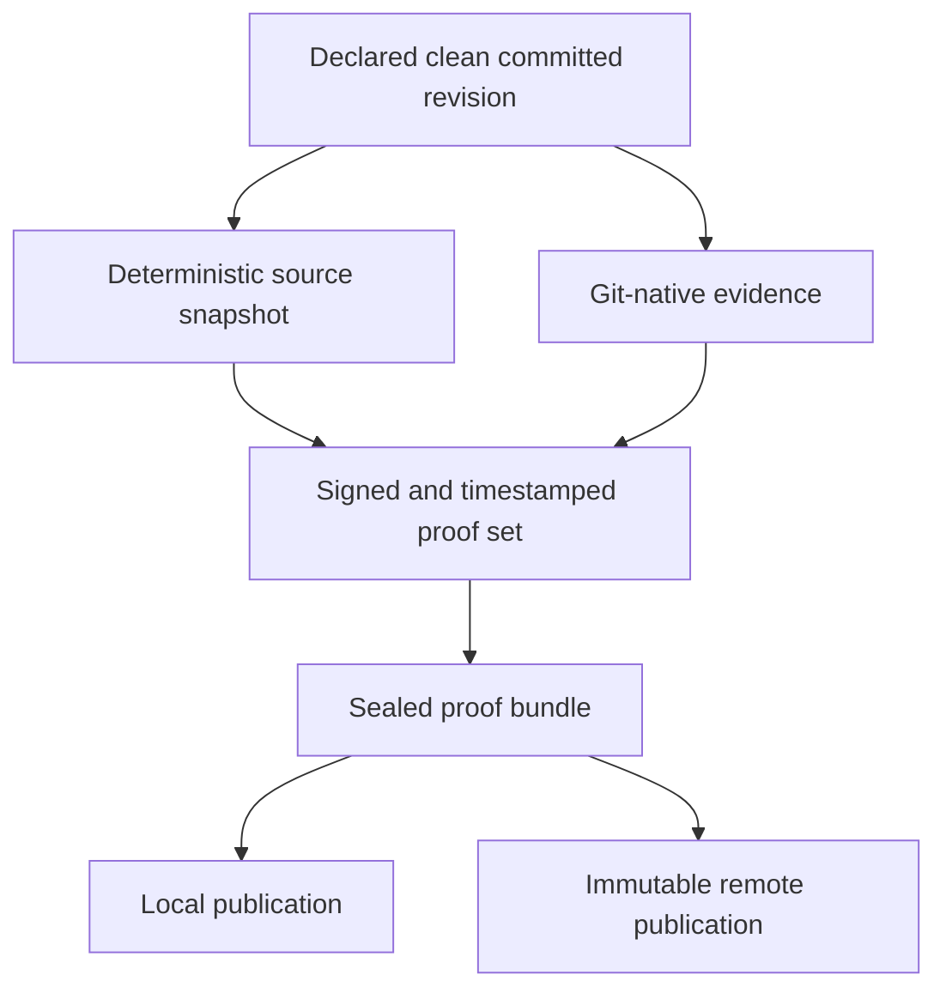

# ProofKit

ProofKit is a Linux evidence pipeline for proving code authorship over time. It captures a declared repository snapshot, creates deterministic source and Git-native evidence, signs it, timestamps it, and publishes a sealed bundle with immutable retention.

## Proof Pipeline

## Bundle Contents

Each bundle contains:

- a deterministic tracked-source snapshot plus manifest and hash material for the declared revision
- Git-native evidence such as `repo.bundle` and repository-state captures from that same revision
- detached signatures and RFC 3161 timestamp responses for the inner proof set
- an outer signed and timestamped bundle for publication as one unit
- remote publication records carrying the returned object identifiers and retention metadata

## Why It Matters

- preserves authorship evidence beyond normal repository history
- creates independently verifiable signed and timestamped artifacts
- supports later disputes around attribution, chronology, or code reuse

## Independent Verification

An independent reviewer can verify the bundle in a fixed sequence:

1. Verify the detached signatures and RFC 3161 timestamps against external signing and timestamp trust roots.
2. Check the source snapshot manifest and hashes for the tracked tree captured from the declared revision.
3. Inspect the Git-native artifacts for the same revision and repository history.
4. Verify the outer bundle signature and timestamp so the published unit is checked as a whole.
5. Compare the remote publication records with returned object identifiers and retention metadata.

## What It Provides

ProofKit preserves authorship and timeline evidence for a repository snapshot by sealing its tracked state and recorded contribution history with signatures, timestamps, and immutable publication.
